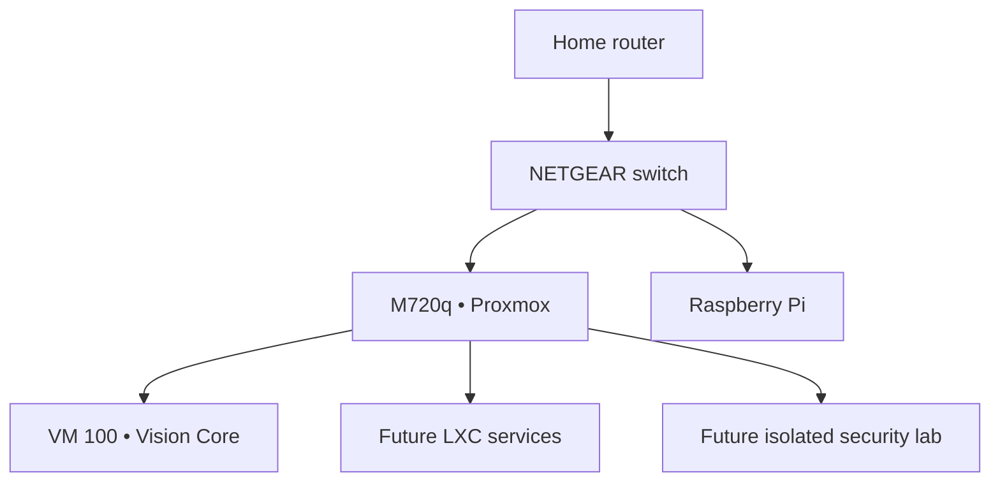

# VISION NODE // PROTOTYPE 01

> A compact home-lab node for virtualization, Linux, cloud engineering, automation, networking, and authorized security research.

## Mission

Vision Node is a practical mini data center built by V. Dixon / VISION AMPLIFIED. Prototype 01 converts a Lenovo ThinkCentre M720q into a controlled environment for learning, building, breaking, restoring, and documenting systems.

This repository is both:

1. An installation runbook for rebuilding the node from scratch.
2. A public build journal showing the decisions, tests, failures, and lessons behind the prototype.

## Confirmed hardware

| Component | Specification |
| --- | --- |
| Compute | Lenovo ThinkCentre M720q Tiny |
| CPU | Intel Core i5-8400T, 6 cores |
| Memory | 16 GB RAM |
| Primary storage | 500 GB NVMe |
| Networking | Wired Ethernet for management; Wi-Fi retained for later experiments |
| Hypervisor | Proxmox VE 9.2 |
| First guest | Ubuntu Server 26.04.1 LTS |

Additional switch, Raspberry Pi, display, and rack details will be added after their model numbers are confirmed.

## Initial architecture

The first launch uses one trusted LAN. VLAN segmentation is a later phase, after the base system is stable and recoverable.

## Resource plan

| Workload | vCPU | RAM | Disk | Launch phase |
| --- | ---: | ---: | ---: | --- |
| Proxmox host reserve | — | 3–4 GB | Host-managed | 1 |
| Vision Core Ubuntu VM | 4 | 6 GB | 80 GB | 1 |
| Network-services LXC | 1 | 1 GB | 12 GB | 2 |
| Security VM | 2–4 | 4–6 GB | 60 GB | 3; run only when needed |

Do not allocate all 16 GB. The host and storage cache need breathing room. Keep at least 150 GB available for ISO images, snapshots, backups, and experiments.

## Build sequence

- [ ] [Record hardware and recovery information](docs/00-hardware-inventory.md)
- [ ] [Complete the no-data-loss preflight](docs/01-preflight.md)
- [ ] [Configure the M720q BIOS](docs/02-bios.md)
- [ ] [Install Proxmox VE](docs/03-proxmox-install.md)
- [ ] [Complete Proxmox first boot](docs/04-proxmox-first-boot.md)
- [ ] [Create the Vision Core Ubuntu VM](docs/05-ubuntu-vision-core.md)
- [ ] [Validate and establish backups](docs/06-validation-backup.md)
- [ ] [Document the build safely](docs/07-github-build-log.md)

## Operating rules

1. Ethernet is the management path.
2. Never expose the Proxmox web interface directly to the public internet.
3. Never commit secrets or personally identifying network information.
4. Snapshot before risky experiments; backups remain separate from the node.
5. Security testing is restricted to systems you own or are explicitly authorized to test.
6. Change one major layer at a time and validate before continuing.

## Current milestone

**Prototype assembled → OS installation preparation**

See [CHANGELOG.md](CHANGELOG.md) for documented milestones and [SECURITY.md](SECURITY.md) before sharing screenshots or configurations.

## Author

Vewiser L. Dixon III  
VISION AMPLIFIED

## References

- [Proxmox VE installation guide](https://pve.proxmox.com/pve-docs/chapter-pve-installation.html)
- [Proxmox VE administration guide](https://pve.proxmox.com/pve-docs/pve-admin-guide.html)
- [Ubuntu Server download](https://ubuntu.com/download/server)
- [GitHub documentation](https://docs.github.com/)
