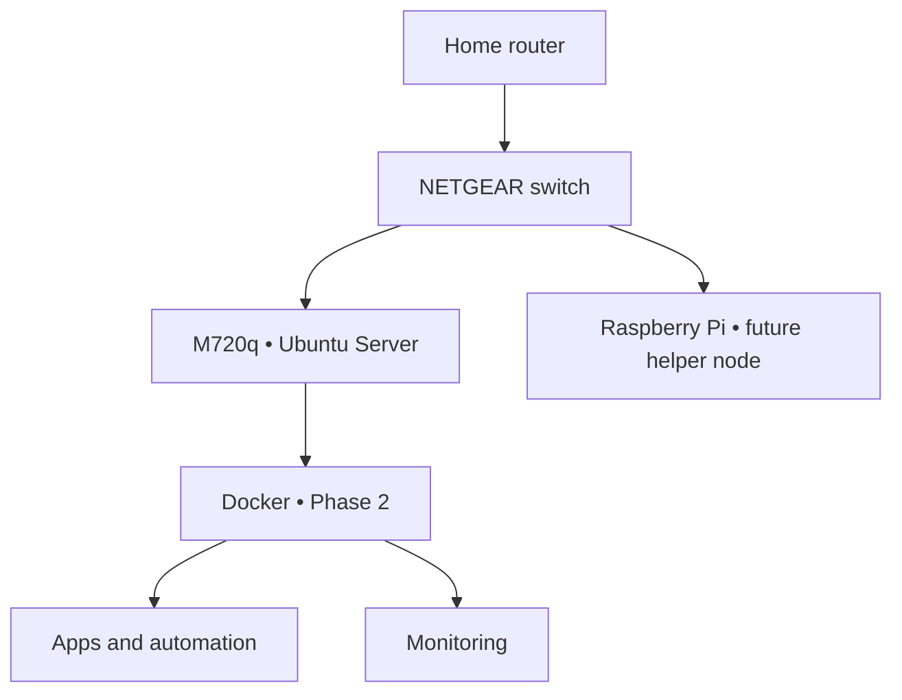

# VISION NODE // PROTOTYPE 01

> A compact Linux node for learning servers, networking, automation, containers, cloud workflows, and authorized security research.

## Mission

Vision Node is a practical mini data center built by V. Dixon / VISION AMPLIFIED. Prototype 01 converts a Lenovo ThinkCentre M720q into one clean, understandable Linux server.

The first prototype intentionally uses **Ubuntu Server directly on the hardware**. This keeps the starting system simple: one machine, one operating system, one network connection, and one layer to troubleshoot. Virtualization with Proxmox remains a future expansion after the Linux foundation is stable.

## Confirmed hardware

| Component | Specification |
| --- | --- |
| Compute | Lenovo ThinkCentre M720q Tiny |
| CPU | Intel Core i5-8400T, 6 cores |
| Memory | 16 GB RAM |
| Primary storage | 500 GB NVMe |
| Networking | Wired Ethernet primary; Wi-Fi optional later |
| Operating system | Ubuntu Server 26.04.1 LTS, x86-64 |
| Hostname | `vision-node-01` |

## Prototype 01 architecture

## What this first node will teach

- Installing and maintaining Linux
- Users, permissions, packages, services, and logs
- Wired networking, DHCP reservations, DNS, and SSH
- Git and GitHub documentation
- Docker containers after the base system is proven
- Monitoring and backups
- Controlled automation and cloud-engineering practice

## Build sequence

- [ ] [Record hardware and recovery information](docs/00-hardware-inventory.md)
- [ ] [Complete the no-data-loss preflight](docs/01-preflight.md)
- [ ] [Configure the M720q BIOS](docs/02-bios.md)
- [ ] [Install Ubuntu Server](docs/03-ubuntu-install.md)
- [ ] [Complete first boot and SSH](docs/04-ubuntu-first-boot.md)
- [ ] [Install the starter toolset](docs/05-starter-stack.md)
- [ ] [Validate and establish backups](docs/06-validation-backup.md)
- [ ] [Document the build safely](docs/07-github-build-log.md)

## Operating rules

1. Ethernet is the primary connection.
2. Never expose SSH, Docker, Cockpit, or another dashboard directly to the public internet.
3. Never commit credentials or identifying network information.
4. Install one layer, test it, and document it before adding another.
5. Maintain a separate backup of anything that cannot be rebuilt.
6. Security testing is limited to systems you own or have explicit permission to test.

## Current milestone

**Prototype assembled → Ubuntu installation preparation**

The future virtualization route is preserved in [Proxmox Upgrade Path](docs/future/proxmox-upgrade-path.md).

## Author

Vewiser L. Dixon III  
VISION AMPLIFIED

## References

- [Ubuntu Server download](https://ubuntu.com/download/server)
- [Ubuntu Server documentation](https://documentation.ubuntu.com/server/)
- [Docker Engine documentation](https://docs.docker.com/engine/)
- [GitHub documentation](https://docs.github.com/)
