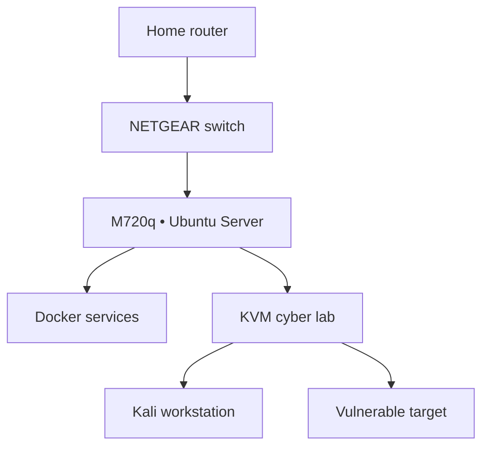

# VISION NODE // PROTOTYPE 01

> A compact Linux node for learning servers, networking, automation, containers, cloud workflows, and authorized security research.

## Mission

Vision Node is a practical mini data center built by V. Dixon / VISION AMPLIFIED. Prototype 01 uses Ubuntu Server directly on a Lenovo M720q. The cyber lab runs as isolated KVM virtual machines inside Ubuntu so intentionally vulnerable systems never join the physical home network.

## Confirmed hardware

| Component | Specification |
| --- | --- |
| Compute | Lenovo ThinkCentre M720q Tiny |
| CPU | Intel Core i5-8400T, 6 cores |
| Memory | 16 GB RAM |
| Primary storage | 500 GB NVMe |
| Networking | Wired Ethernet primary; Wi-Fi optional later |
| Operating system | Ubuntu Server 26.04.1 LTS, x86-64 |
| Hostname | `vision-node-01` |

## Prototype architecture

The target VM is attached only to a non-routed virtual network. It is never bridged to the NETGEAR switch, home LAN, or internet.

## Build sequence

- [ ] [Hardware inventory](docs/00-hardware-inventory.md)
- [ ] [No-data-loss preflight](docs/01-preflight.md)
- [ ] [M720q BIOS](docs/02-bios.md)
- [ ] [Install Ubuntu Server](docs/03-ubuntu-install.md)
- [ ] [First boot and SSH](docs/04-ubuntu-first-boot.md)
- [ ] [Starter toolset](docs/05-starter-stack.md)
- [ ] [Validate and back up](docs/06-validation-backup.md)
- [ ] [Document the build](docs/07-github-build-log.md)
- [ ] [Build the isolated cyber lab](docs/modules/hacking-lab/README.md)

## Cyber lab boundaries

1. Test only systems you own or are explicitly authorized to test.
2. Keep vulnerable targets off physical, bridged, and public networks.
3. Use Kali update mode and lab mode separately.
4. Never store real credentials or personal data in targets.
5. Shut down lab guests when training ends.
6. Restore disposable targets after exercises.

## Current milestone

**Prototype assembled → Ubuntu installation preparation**

- [Hacking Lab Module](docs/modules/hacking-lab/README.md)
- [Future Proxmox Path](docs/future/proxmox-upgrade-path.md)
- [Security Policy](SECURITY.md)

## Author

Vewiser L. Dixon III  
VISION AMPLIFIED

## Official references

- [Ubuntu Server documentation](https://documentation.ubuntu.com/server/)
- [Kali Linux documentation](https://www.kali.org/docs/)
- [OWASP Vulnerable Web Applications Directory](https://vwad.owasp.org/)
- [Rapid7 Metasploitable documentation](https://docs.rapid7.com/metasploit/metasploitable-2/)
