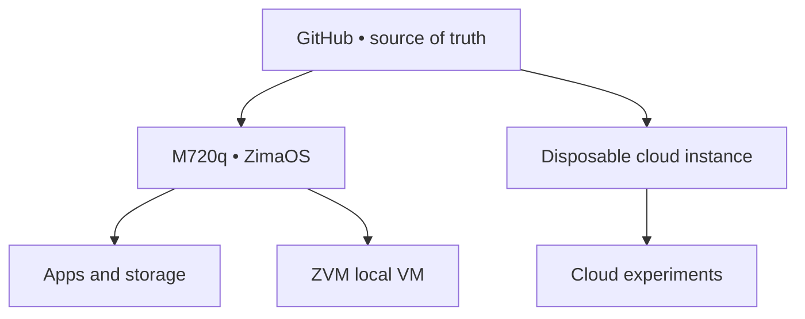

# VISION NODE // PROTOTYPE 01

> A beginner-friendly personal cloud, app server, VM lab, and cloud-engineering node.

## Mission

Vision Node Prototype 01 uses ZimaOS to make the first server approachable without giving up real experimentation. The M720q becomes the always-on local control node; ZVM provides local virtual machines; a disposable Ubuntu cloud instance provides an off-site engineering sandbox.

## Confirmed hardware

| Component | Specification |
| --- | --- |
| Compute | Lenovo ThinkCentre M720q Tiny |
| CPU | Intel Core i5-8400T, 6 cores |
| Memory | 16 GB RAM |
| Primary storage | 500 GB NVMe |
| Primary connection | Internal 5 GHz Wi-Fi |
| Host OS | Current stable ZimaOS for generic x86-64 |
| Local virtualization | ZVM |
| Cloud guest | Ubuntu Server LTS |

## Architecture

### Local node

- ZimaOS dashboard
- Internal Wi-Fi as the permanent connection
- File storage and backups
- App Store/Docker services
- Uptime Kuma and selected automation
- One active local VM at a time

### Cloud node

- Disposable Ubuntu instance
- Terraform/OpenTofu practice
- Web server and API experiments
- CI/CD and observability practice
- Destroyed after each project or session

## Beginner build sequence

- [ ] [Hardware inventory](docs/00-hardware-inventory.md)
- [ ] [No-data-loss preflight](docs/01-preflight.md)
- [ ] [M720q BIOS](docs/02-bios.md)
- [ ] [Install ZimaOS](docs/03-zimaos-install.md)
- [ ] [Complete first boot](docs/04-zimaos-first-boot.md)
- [ ] [Configure direct Wi-Fi mode](docs/04a-wireless-mode.md)
- [ ] [Install first apps](docs/05-zimaos-starter-stack.md)
- [ ] [Create the first ZVM guest](docs/06-zvm-first-vm.md)
- [ ] [Launch a disposable cloud instance](docs/modules/cloud-lab/README.md)
- [ ] [Validate backup and recovery](docs/06-validation-backup.md)
- [ ] [Document the build](docs/07-github-build-log.md)
- [ ] [Unlock the isolated cyber lab](docs/modules/hacking-lab/README.md)

## Resource rule

With 16 GB RAM, keep at least 6–8 GB available to ZimaOS and its apps. Start local VMs at 2 vCPU and 4 GB RAM. Run only one substantial VM at a time until memory is upgraded.

## Operating model

**BUILD → AUTOMATE → ISOLATE → ATTACK → DETECT → DEFEND → PROVE**

## Safety rules

- Never expose the ZimaOS dashboard directly to the public internet.
- Never place vulnerable targets on the home LAN.
- Use MFA, separate cloud credentials, budgets, and least privilege.
- Never commit secrets, real network details, or state files.
- Back up before experiments; prove restore before trusting a backup.
- Test only systems you own or are explicitly authorized to assess.
- Adopt experimental host operating systems only after their reliability and recovery paths are proven.

## Current milestone

**Prototype assembled → ZimaOS installation preparation**

- [ZimaOS Installation](docs/03-zimaos-install.md)
- [Direct Wi-Fi Mode](docs/04a-wireless-mode.md)
- [ZVM First VM](docs/06-zvm-first-vm.md)
- [Cloud Lab](docs/modules/cloud-lab/README.md)
- [Cyber Lab](docs/modules/hacking-lab/README.md)

## Deferred ideas

Omarchy was evaluated as a potential operator-console OS and intentionally deferred until it has a longer stability record for this use case. The evaluation remains recoverable through Git history.

## Author

Vewiser L. Dixon III  
VISION AMPLIFIED

## Official references

- [ZimaOS](https://www.zimaspace.com/zimaos/)
- [ZimaOS documentation](https://www.zimaspace.com/docs/)
- [Ubuntu Server](https://ubuntu.com/download/server)
- [GitHub documentation](https://docs.github.com/)
