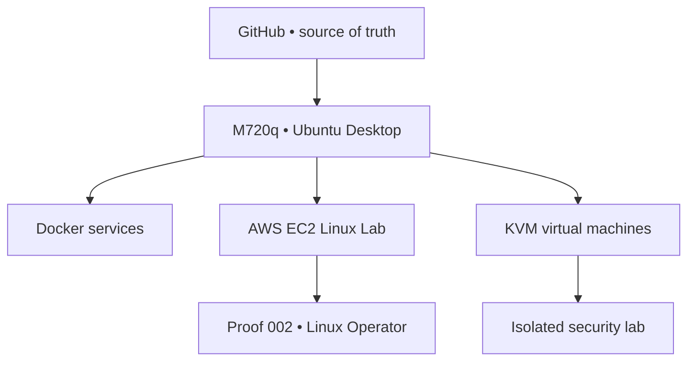

# VISION NODE // PROTOTYPE 01

> A compact Ubuntu-powered mini data center for learning Linux, cloud engineering, automation, and ethical security.

## Mission

Vision Node Prototype 01 turns a Lenovo ThinkCentre M720q into a practical first mini data center. Ubuntu Desktop provides a visual starting point without giving up the real Linux terminal. Docker runs useful services; Amazon EC2 provides disposable remote Linux practice; KVM/libvirt supports controlled virtual machines and an isolated ethical-security lab.

The goal is not to install everything at once. The goal is to understand every layer, prove that it works, and document the process.

## Operating-system path

| Stage | Operating system | Purpose |
| --- | --- | --- |
| Start | Ubuntu Desktop 26.04.1 LTS | Learn visually, configure Wi-Fi easily, use Terminal, and operate the node locally |
| Cloud lab | Ubuntu Server LTS on EC2 | Practice remote Linux administration without risking the local node |
| Compare | Amazon Linux 2023 on EC2 | Prove that Linux skills transfer across distributions |
| Upgrade | Ubuntu Server LTS on M720q | Run lean and headless after the Desktop build is stable and reproducible |
| Future | Proxmox | Support multiple simultaneous VMs after the workload and hardware justify it |

## Confirmed hardware

| Component | Specification |
| --- | --- |
| Compute | Lenovo ThinkCentre M720q Tiny |
| CPU | Intel Core i5-8400T, 6 cores |
| Memory | 16 GB RAM |
| Primary storage | 500 GB NVMe |
| Primary connection | Internal 5 GHz Wi-Fi |
| Starting OS | Ubuntu Desktop 26.04.1 LTS |
| Containers | Docker Engine + Compose |
| Local virtualization | KVM/libvirt |
| Cloud practice | Temporary Amazon EC2 Linux instances |

## Architecture

```mermaid
flowchart TD
    G["GitHub • source of truth"] --> U["M720q • Ubuntu Desktop"]
    U --> D["Docker services"]
    U --> A["AWS EC2 Linux Lab"]
    U --> V["KVM virtual machines"]
    A --> P["Proof 002 • Linux Operator"]
    V --> S["Isolated security lab"]
```

### Local node

- Ubuntu Desktop with the Linux terminal underneath
- Small display as a local command and monitoring screen
- Internal Wi-Fi as the permanent connection after validation
- Docker services and private automation
- Monitoring, backups, and recovery practice
- One substantial local VM at a time on the 16 GB baseline

### Amazon EC2 Linux lab

- Disposable Ubuntu Server and Amazon Linux instances
- SSH and Systems Manager practice
- Users, permissions, services, storage, networking, and logs
- CloudWatch monitoring
- Controlled failures and recovery
- cloud-init, Ansible, and Terraform/OpenTofu progression
- Budget alerts, tagging, proof, and complete teardown

## Beginner build sequence

- [ ] [Hardware inventory](docs/00-hardware-inventory.md)
- [ ] [No-data-loss preflight](docs/01-preflight.md)
- [ ] [M720q BIOS](docs/02-bios.md)
- [ ] [Install Ubuntu Desktop](docs/03-ubuntu-desktop-install.md)
- [ ] [Secure the first boot](docs/04-ubuntu-first-boot.md)
- [ ] [Validate Wi-Fi mode](docs/04a-wireless-mode.md)
- [ ] [Install the starter stack](docs/05-starter-stack.md)
- [ ] Run the node continuously for 48 hours
- [ ] [Validate backup and recovery](docs/06-validation-backup.md)
- [ ] Document **Proof 001 // Local Node**
- [ ] [Complete the Amazon EC2 Linux Mastery Lab](docs/modules/aws-ec2-linux-lab/README.md)
- [ ] Document **Proof 002 // EC2 Linux Operator**
- [ ] [Document the build](docs/07-github-build-log.md)
- [ ] [Unlock the isolated cyber lab](docs/modules/hacking-lab/README.md)

## Resource rule

With 16 GB RAM, keep at least 6 GB available to Ubuntu Desktop and core services. Start local lab VMs at 2 vCPU and 4 GB RAM. Run only one substantial local VM at a time. EC2 resources remain small, temporary, tagged, monitored, and fully deleted after each lab.

## Operating model

**UNDERSTAND → BUILD → DOCUMENT → SECURE → BREAK → RECOVER → PROVE → DESTROY**

## Safety rules

- Never expose SSH, dashboards, Docker, or libvirt broadly to the public internet.
- Never place intentionally vulnerable targets on the home LAN or a public EC2 address.
- Use MFA, separate lab credentials, budget alerts, tags, and least privilege.
- Never commit secrets, real network details, cloud state, private keys, or AWS resource identifiers.
- Back up before experiments; prove restore before trusting a backup.
- Test only systems you own or are explicitly authorized to assess.
- Keep the ethical-security lab locked until network isolation has been tested.
- Verify EC2, EBS, snapshot, public IPv4, CloudWatch, and data-transfer costs before extended labs.

## Current milestone

**Prototype assembled → Ubuntu Desktop installation preparation**

- [Ubuntu Desktop Installation](docs/03-ubuntu-desktop-install.md)
- [Ubuntu First Boot](docs/04-ubuntu-first-boot.md)
- [Direct Wi-Fi Mode](docs/04a-wireless-mode.md)
- [Starter Stack](docs/05-starter-stack.md)
- [Amazon EC2 Linux Mastery Lab](docs/modules/aws-ec2-linux-lab/README.md)
- [Ubuntu Server Upgrade Path](docs/future/ubuntu-server-upgrade-path.md)
- [Proxmox Upgrade Path](docs/future/proxmox-upgrade-path.md)
- [Cyber Lab](docs/modules/hacking-lab/README.md)

## Author

Vewiser L. Dixon III  
VISION AMPLIFIED

## Official references

- [Ubuntu Desktop](https://ubuntu.com/download/desktop)
- [Ubuntu Desktop documentation](https://documentation.ubuntu.com/desktop/)
- [Amazon EC2 documentation](https://docs.aws.amazon.com/ec2/)
- [AWS Systems Manager Session Manager](https://docs.aws.amazon.com/systems-manager/latest/userguide/session-manager.html)
- [Docker Engine on Ubuntu](https://docs.docker.com/engine/install/ubuntu/)
- [libvirt documentation](https://libvirt.org/docs.html)
- [GitHub documentation](https://docs.github.com/)
