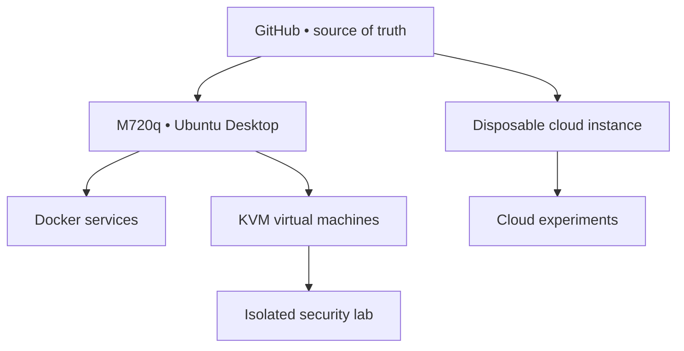

# VISION NODE // PROTOTYPE 01

> A compact Ubuntu-powered mini data center for learning Linux, cloud engineering, automation, and ethical security.

## Mission

Vision Node Prototype 01 turns a Lenovo ThinkCentre M720q into a practical first mini data center. Ubuntu Desktop provides a visual starting point without giving up the real Linux terminal. Docker runs useful services; KVM/libvirt supports controlled virtual machines; disposable cloud resources extend the lab beyond the house.

The goal is not to install everything at once. The goal is to understand every layer, prove that it works, and document the process.

## Operating-system path

| Stage | Operating system | Purpose |
| --- | --- | --- |
| Start | Ubuntu Desktop 26.04.1 LTS | Learn visually, configure Wi-Fi easily, use Terminal, and operate the node locally |
| Upgrade | Ubuntu Server LTS | Run lean and headless after the Desktop build is stable, backed up, and reproducible |
| Future | Proxmox | Support multiple simultaneous VMs after the workload and hardware justify it |

## Confirmed hardware

| Component | Specification |
| --- | --- |
| Compute | Lenovo ThinkCentre M720q Tiny |
| CPU | Intel Core i5-8400T, 6 cores |
| Memory | 16 GB RAM |
| Primary storage | 500 GB NVMe |
| Primary connection | Internal 5 GHz Wi-Fi |
| Starting OS | Ubuntu Desktop 26.04.1 LTS |
| Containers | Docker Engine + Compose |
| Local virtualization | KVM/libvirt |
| Cloud lab | Disposable Ubuntu instances |

## Architecture

```mermaid
flowchart TD
    G["GitHub • source of truth"] --> U["M720q • Ubuntu Desktop"]
    G --> C["Disposable cloud instance"]
    U --> D["Docker services"]
    U --> V["KVM virtual machines"]
    V --> S["Isolated security lab"]
    C --> E["Cloud experiments"]
```

### Local node

- Ubuntu Desktop with the Linux terminal underneath
- Small display as a local command and monitoring screen
- Internal Wi-Fi as the permanent connection after validation
- Docker services and private automation
- Monitoring, backups, and recovery practice
- One substantial VM at a time on the 16 GB baseline
- KVM/libvirt for isolated lab guests

### Cloud node

- Disposable Ubuntu instance
- Terraform/OpenTofu practice
- Web server and API experiments
- CI/CD and observability practice
- Budget alerts and documented teardown
- No irreplaceable data stored only in the cloud lab

## Beginner build sequence

- [ ] [Hardware inventory](docs/00-hardware-inventory.md)
- [ ] [No-data-loss preflight](docs/01-preflight.md)
- [ ] [M720q BIOS](docs/02-bios.md)
- [ ] [Install Ubuntu Desktop](docs/03-ubuntu-desktop-install.md)
- [ ] [Secure the first boot](docs/04-ubuntu-first-boot.md)
- [ ] [Validate Wi-Fi mode](docs/04a-wireless-mode.md)
- [ ] [Install the starter stack](docs/05-starter-stack.md)
- [ ] Run the node continuously for 48 hours
- [ ] [Launch a disposable cloud instance](docs/modules/cloud-lab/README.md)
- [ ] [Validate backup and recovery](docs/06-validation-backup.md)
- [ ] [Document the build](docs/07-github-build-log.md)
- [ ] [Unlock the isolated cyber lab](docs/modules/hacking-lab/README.md)

## Resource rule

With 16 GB RAM, keep at least 6 GB available to Ubuntu Desktop and core services. Start lab VMs at 2 vCPU and 4 GB RAM. Run only one substantial VM at a time until memory is upgraded.

## Operating model

**BUILD → AUTOMATE → ISOLATE → TEST → DETECT → DEFEND → PROVE**

## Safety rules

- Never expose SSH, dashboards, Docker, or libvirt directly to the public internet.
- Never place intentionally vulnerable targets on the home LAN.
- Use MFA, separate cloud credentials, budget alerts, and least privilege.
- Never commit secrets, real network details, cloud state, or private keys.
- Back up before experiments; prove restore before trusting a backup.
- Test only systems you own or are explicitly authorized to assess.
- Keep the security lab locked until network isolation has been tested.

## Current milestone

**Prototype assembled → Ubuntu Desktop installation preparation**

- [Ubuntu Desktop Installation](docs/03-ubuntu-desktop-install.md)
- [Ubuntu First Boot](docs/04-ubuntu-first-boot.md)
- [Direct Wi-Fi Mode](docs/04a-wireless-mode.md)
- [Starter Stack](docs/05-starter-stack.md)
- [Ubuntu Server Upgrade Path](docs/future/ubuntu-server-upgrade-path.md)
- [Proxmox Upgrade Path](docs/future/proxmox-upgrade-path.md)
- [Cloud Lab](docs/modules/cloud-lab/README.md)
- [Cyber Lab](docs/modules/hacking-lab/README.md)

## Author

Vewiser L. Dixon III  
VISION AMPLIFIED

## Official references

- [Ubuntu Desktop](https://ubuntu.com/download/desktop)
- [Ubuntu Desktop documentation](https://documentation.ubuntu.com/desktop/)
- [Ubuntu Server](https://ubuntu.com/download/server)
- [Docker Engine on Ubuntu](https://docs.docker.com/engine/install/ubuntu/)
- [libvirt documentation](https://libvirt.org/docs.html)
- [GitHub documentation](https://docs.github.com/)
