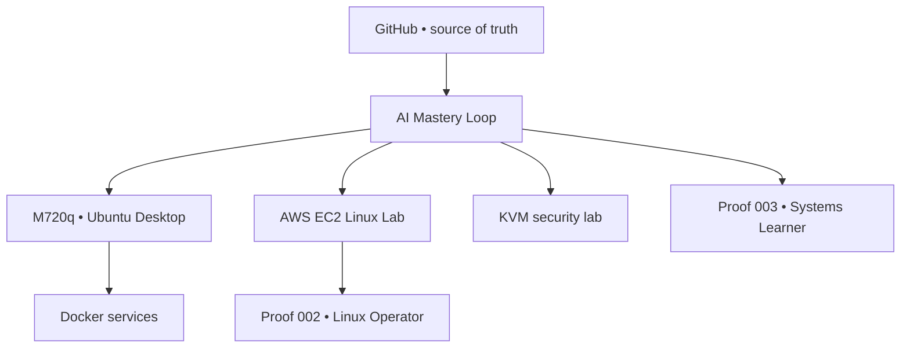

# VISION NODE // PROTOTYPE 01

> A compact Ubuntu-powered mini data center for learning Linux, cloud engineering, automation, and ethical security.

## Mission

Vision Node Prototype 01 turns a Lenovo ThinkCentre M720q into a practical first mini data center. Ubuntu Desktop provides a visual starting point without giving up the real Linux terminal. Docker runs useful services; Amazon EC2 provides disposable remote Linux practice; KVM/libvirt supports controlled virtual machines and an isolated ethical-security lab.

AI supports the learning process as a coach, examiner, and review partner. It does not replace reading, first attempts, verification, recovery, or independent proof.

## Mastery method

```mermaid
flowchart LR
    R["Read"] --> A["Ask AI"]
    A --> Q["Quiz"]
    Q --> P["Apply"]
    P --> R
```

Every technical topic uses the [AI-Assisted Mastery Loop](docs/modules/ai-mastery-loop/README.md):

**READ → ASK AI → QUIZ → APPLY → REPEAT**

A concept is not mastered because AI produced an answer. It is mastered when the operator can recall it, apply it, recover from a safe failure, transfer it to another environment, and teach it clearly.

## Operating-system path

| Stage | Operating system | Purpose |
| --- | --- | --- |
| Start | Ubuntu Desktop 26.04.1 LTS | Learn visually, configure Wi-Fi easily, use Terminal, and operate the node locally |
| Cloud lab | Ubuntu Server LTS on EC2 | Practice remote Linux administration without risking the local node |
| Compare | Amazon Linux 2023 on EC2 | Prove that Linux skills transfer across distributions |
| Upgrade | Ubuntu Server LTS on M720q | Run lean and headless after the Desktop build is stable and reproducible |
| Future | Proxmox | Support multiple simultaneous VMs after the workload and hardware justify it |

## Confirmed hardware

| Component | Specification |
| --- | --- |
| Compute | Lenovo ThinkCentre M720q Tiny |
| CPU | Intel Core i5-8400T, 6 cores |
| Memory | 16 GB RAM |
| Primary storage | 500 GB NVMe |
| Primary connection | Internal 5 GHz Wi-Fi |
| Starting OS | Ubuntu Desktop 26.04.1 LTS |
| Containers | Docker Engine + Compose |
| Local virtualization | KVM/libvirt |
| Cloud practice | Temporary Amazon EC2 Linux instances |
| Learning system | AI-Assisted Mastery Loop |

## Architecture

```mermaid
flowchart TD
    M["AI Mastery Loop"] --> U["M720q • Ubuntu Desktop"]
    M --> A["AWS EC2 Linux Lab"]
    M --> V["KVM security lab"]
    G["GitHub • source of truth"] --> M
    U --> D["Docker services"]
    A --> P["Proof 002 • Linux Operator"]
    M --> P3["Proof 003 • Systems Learner"]
```

## Beginner build sequence

- [ ] [Learn the AI-Assisted Mastery Loop](docs/modules/ai-mastery-loop/README.md)
- [ ] [Hardware inventory](docs/00-hardware-inventory.md)
- [ ] [No-data-loss preflight](docs/01-preflight.md)
- [ ] [M720q BIOS](docs/02-bios.md)
- [ ] [Install Ubuntu Desktop](docs/03-ubuntu-desktop-install.md)
- [ ] [Secure the first boot](docs/04-ubuntu-first-boot.md)
- [ ] [Validate Wi-Fi mode](docs/04a-wireless-mode.md)
- [ ] [Install the starter stack](docs/05-starter-stack.md)
- [ ] Run the node continuously for 48 hours
- [ ] [Validate backup and recovery](docs/06-validation-backup.md)
- [ ] Document **Proof 001 // Local Node**
- [ ] [Complete the Amazon EC2 Linux Mastery Lab](docs/modules/aws-ec2-linux-lab/README.md)
- [ ] Document **Proof 002 // EC2 Linux Operator**
- [ ] Document **Proof 003 // AI-Assisted Systems Learner**
- [ ] [Document the build](docs/07-github-build-log.md)
- [ ] [Unlock the isolated cyber lab](docs/modules/hacking-lab/README.md)

## Proof system

| Proof | Meaning |
| --- | --- |
| Proof 001 | The local Ubuntu node is stable, recoverable, and understood |
| Proof 002 | The operator can build, operate, recover, and remove Linux systems on EC2 |
| Proof 003 | The operator can use AI to improve learning without becoming dependent on it |

## Operating model

**READ → QUESTION → RECALL → APPLY → BREAK SAFELY → RECOVER → VERIFY → TEACH**

## Safety rules

- Never expose SSH, dashboards, Docker, or libvirt broadly to the public internet.
- Never place intentionally vulnerable targets on the home LAN or a public EC2 address.
- Use MFA, separate lab credentials, budget alerts, tags, and least privilege.
- Never commit or paste secrets, private data, real network details, cloud state, private keys, or AWS resource identifiers.
- Verify AI-generated commands and claims against official documentation.
- Run one unfamiliar command at a time and inspect the result.
- Preserve human approval for deletion, billing, public exposure, security, and production changes.
- Test only systems you own or are explicitly authorized to assess.

## Current milestone

**Prototype assembled → Ubuntu Desktop installation preparation**

- [AI-Assisted Mastery Loop](docs/modules/ai-mastery-loop/README.md)
- [Ubuntu Desktop Installation](docs/03-ubuntu-desktop-install.md)
- [Ubuntu First Boot](docs/04-ubuntu-first-boot.md)
- [Direct Wi-Fi Mode](docs/04a-wireless-mode.md)
- [Starter Stack](docs/05-starter-stack.md)
- [Amazon EC2 Linux Mastery Lab](docs/modules/aws-ec2-linux-lab/README.md)
- [Ubuntu Server Upgrade Path](docs/future/ubuntu-server-upgrade-path.md)
- [Proxmox Upgrade Path](docs/future/proxmox-upgrade-path.md)
- [Cyber Lab](docs/modules/hacking-lab/README.md)

## Author

Vewiser L. Dixon III  
VISION AMPLIFIED
