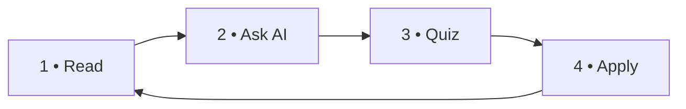

# VISION NODE // AI-Assisted Mastery Loop

> Use AI to understand faster, remember longer, practice deliberately, and prove real skill.

## The method

**READ → ASK AI → QUIZ → APPLY → REPEAT**

This loop can be used with every Vision Node topic: Linux, Ubuntu, Docker, AWS EC2, networking, cloud engineering, automation, recovery, and ethical security.

## What each stage means

| Stage | Action | Proof |
| --- | --- | --- |
| Read | Study one bounded section from an official guide or trusted source | Brief handwritten or typed summary |
| Ask AI | Question confusing ideas, compare concepts, and request plain-language examples | Corrected understanding with source references |
| Quiz | Close the source and answer from memory | Scored recall with mistakes identified |
| Apply | Use the idea in a real, controlled lab | Command output, test result, recovery note, or working artifact |
| Repeat | Send weak areas back through the loop | Improved score and independent performance |

## The core rule

AI may explain, question, compare, simulate, and review. It may not replace the operator's first attempt.

For each lesson:

1. Read before asking AI.
2. Write what you think the concept means.
3. Ask AI to diagnose gaps—not simply summarize everything.
4. Complete the first quiz without notes.
5. Attempt the lab before requesting a solution.
6. Ask for hints one level at a time.
7. Verify commands and claims against official documentation.
8. Repeat weak areas.
9. Explain the principle in plain language.
10. Perform it again on a clean system.

## Mastery levels

| Level | Standard |
| --- | --- |
| 0 — Seen | I recognize the term |
| 1 — Understand | I can explain it simply |
| 2 — Recall | I can answer questions without notes |
| 3 — Apply | I can use it in a guided lab |
| 4 — Recover | I can diagnose and fix a controlled failure |
| 5 — Transfer | I can use it in a different environment |
| 6 — Teach | I can teach it clearly and safely |

A topic is not mastered because AI produced the correct answer. It is mastered when the operator can recall, apply, recover, transfer, and teach it.

## Module sequence

1. [Run the four-stage study session](01-session-loop.md)
2. [Use the prompt and quiz system](02-prompts-and-quiz.md)
3. [Track retention and complete Proof 003](03-retention-and-proof.md)

## Entry gate

- [ ] One specific concept is selected.
- [ ] One primary source is selected.
- [ ] The lab is safe and disposable.
- [ ] Private information is removed from the study material.
- [ ] The expected outcome is written before beginning.
- [ ] The session has a stop time.

## AI safety and quality rules

- Never paste credentials, private keys, tokens, real IPs, customer information, patient information, family data, private logs, or unredacted configurations into an AI system.
- Use synthetic examples and reserved documentation addresses.
- Ask AI to distinguish fact, inference, and uncertainty.
- Require links to official documentation for commands, security settings, prices, versions, and service behavior.
- Run one command at a time and inspect the result.
- Never run destructive commands copied from AI without understanding the exact target.
- Never use AI output as authorization to test a third-party system.
- Preserve human approval for security, billing, deletion, public exposure, and production changes.

## Completion standard

The AI-Assisted Mastery Loop is working when the operator can:

- Turn a large topic into a small study target
- Explain the target before receiving an AI answer
- Ask focused questions
- Pass a closed-book quiz
- Complete a controlled lab
- Identify and correct an AI mistake
- Recover from a safe failure
- Repeat the skill on a clean system
- Teach the idea in two minutes
- Return after several days and still perform it

## Final principle

**AI can shorten the path to understanding. It cannot replace attention, repetition, judgment, or proof.**
