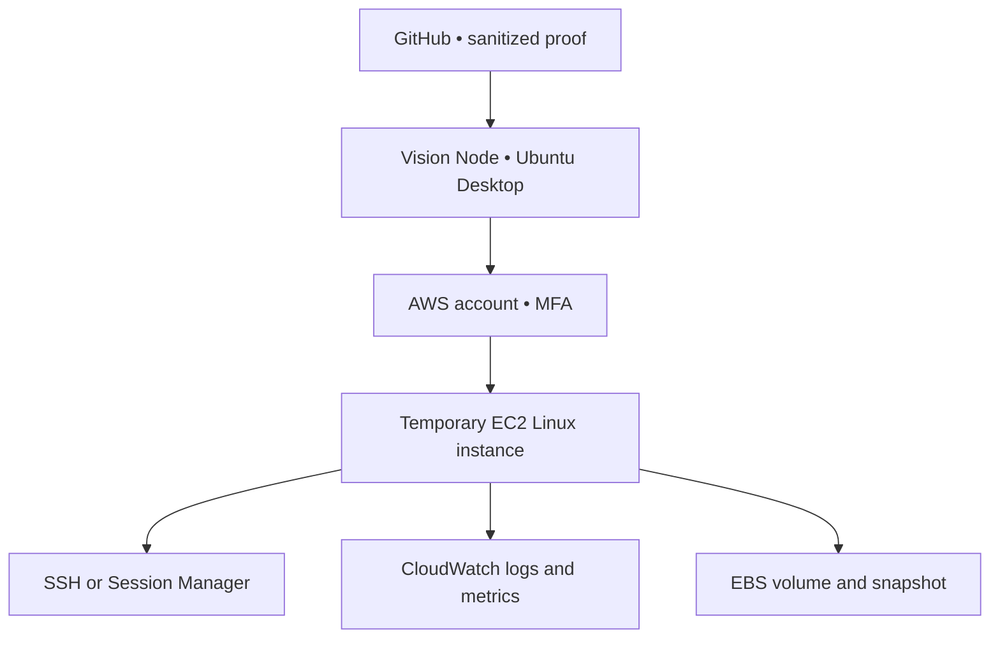

# VISION NODE // Amazon EC2 Linux Mastery Lab

> Learn Linux by building, operating, repairing, documenting, and deleting real cloud servers.

## Purpose

This module gives Vision Node a repeatable Amazon EC2 practice environment. The local M720q remains the command center. EC2 provides temporary remote Linux machines that can be created, broken, recovered, and terminated without risking the local node.

The goal is not to keep a cloud server running forever. The goal is to become comfortable operating Linux anywhere.

## Learning model

**UNDERSTAND → BUILD → DOCUMENT → SECURE → BREAK → RECOVER → PROVE → DESTROY**

## Starting architecture

## Distribution path

| Stage | Distribution | Why |
| --- | --- | --- |
| Start | Ubuntu Server LTS | Matches the local Ubuntu foundation and has familiar commands |
| Compare | Amazon Linux 2023 | Teaches package-manager, defaults, and cloud-image differences |
| Optional | A second mainstream distribution | Proves that skills transfer beyond one Linux family |

Always select a current image published by the operating-system vendor or AWS. Record the image name and architecture, but do not publish account-specific identifiers.

## Module sequence

1. [Launch a secure practice instance](01-launch-secure-instance.md)
2. [Complete the Linux mastery path](02-linux-mastery-path.md)
3. [Capture proof and tear everything down](03-proof-and-teardown.md)

## Entry gate

Before beginning:

- [ ] AWS root user has MFA.
- [ ] Daily and monthly budget alerts exist.
- [ ] A dedicated lab IAM identity or role is used for normal work.
- [ ] The selected region is recorded privately.
- [ ] The cost and cleanup checklist is open.
- [ ] No client, family, dental, studio, or production data will be used.
- [ ] GitHub security rules have been reviewed.

## Core rules

- Use one small general-purpose instance at a time.
- Verify current pricing and any Free Tier eligibility before launch.
- Treat Free Tier as a discount, not a guarantee of zero cost.
- Tag every resource with owner, project, purpose, and planned deletion date.
- Allow SSH only from the operator's current public IP when SSH is required.
- Prefer AWS Systems Manager Session Manager after the initial SSH lesson.
- Never expose a vulnerable target to the public internet.
- Never store AWS access keys, private keys, Terraform state, or real addresses in this repository.
- Stop does not necessarily stop every charge. Terminate and verify related storage, snapshots, addresses, logs, and other resources.
- Budget alerts can be delayed; they are warnings, not perfect spending caps.

## Completion standard

Linux EC2 Mastery is complete when the operator can:

- Launch and identify a Linux instance safely
- Connect without password authentication
- Navigate the filesystem and explain key directories
- Manage users, groups, ownership, and permissions
- Install and remove software
- Inspect processes, services, ports, logs, storage, and memory
- Configure a service and confirm it survives reboot
- Attach, format, mount, and remove disposable storage
- Create and restore from a snapshot or rebuild from documentation
- Monitor the instance
- Reproduce the build with cloud-init or infrastructure as code
- Terminate all resources and verify the account is clean
- Explain the work in plain language

## Official references

- [Amazon EC2 concepts](https://docs.aws.amazon.com/AWSEC2/latest/UserGuide/concepts.html)
- [Connect to Linux with SSH](https://docs.aws.amazon.com/AWSEC2/latest/UserGuide/connect-linux-inst-ssh.html)
- [AWS Systems Manager Session Manager](https://docs.aws.amazon.com/systems-manager/latest/userguide/session-manager.html)
- [CloudWatch agent](https://docs.aws.amazon.com/AmazonCloudWatch/latest/monitoring/Install-CloudWatch-Agent.html)
- [AWS Budgets](https://docs.aws.amazon.com/cost-management/latest/userguide/budgets-managing-costs.html)
