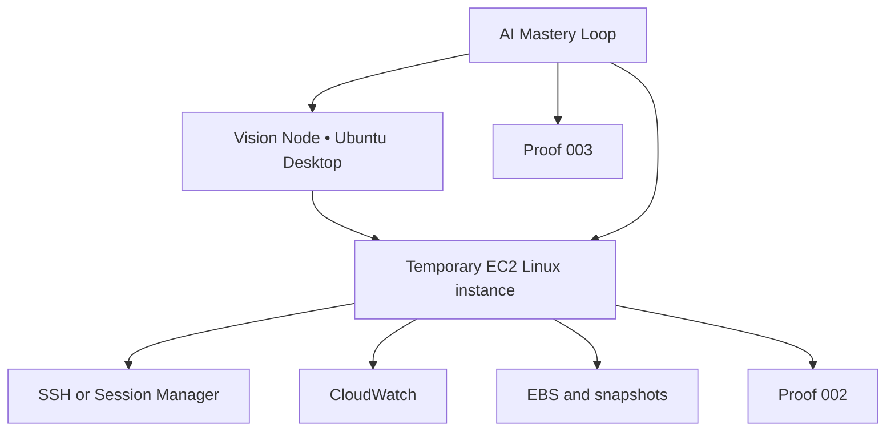

# VISION NODE // Amazon EC2 Linux Mastery Lab

> Learn Linux by building, operating, repairing, documenting, and deleting real cloud servers.

## Purpose

This module gives Vision Node a repeatable Amazon EC2 practice environment. The local M720q remains the command center. EC2 provides temporary remote Linux machines that can be created, broken, recovered, and terminated without risking the local node.

Use the [AI-Assisted Mastery Loop](../ai-mastery-loop/README.md) for every major topic:

**READ → ASK AI → QUIZ → APPLY → REPEAT**

AI may explain, quiz, and guide diagnosis. It does not replace the first attempt, official documentation, command review, recovery proof, or independent repetition.

## Learning model

**UNDERSTAND → BUILD → DOCUMENT → SECURE → BREAK → RECOVER → PROVE → DESTROY**

## Starting architecture

## Distribution path

| Stage | Distribution | Why |
| --- | --- | --- |
| Start | Ubuntu Server LTS | Matches the local Ubuntu foundation and has familiar commands |
| Compare | Amazon Linux 2023 | Teaches package-manager, defaults, and cloud-image differences |
| Optional | A second mainstream distribution | Proves that skills transfer beyond one Linux family |

## Module sequence

1. [Launch a secure practice instance](01-launch-secure-instance.md)
2. [Complete the Linux mastery path](02-linux-mastery-path.md)
3. [Capture proof and tear everything down](03-proof-and-teardown.md)
4. Apply the AI loop and complete [Proof 003](../ai-mastery-loop/03-retention-and-proof.md)

## Entry gate

- [ ] AWS root user has MFA.
- [ ] Daily and monthly budget alerts exist.
- [ ] A dedicated lab identity or role is used.
- [ ] The cost and cleanup checklist is open.
- [ ] No real client, family, dental, studio, or production data will be used.
- [ ] The AI and GitHub security rules have been reviewed.

## Core rules

- Use one small general-purpose instance at a time.
- Verify current pricing and Free Tier eligibility before launch.
- Tag every resource with owner, project, purpose, and deletion date.
- Allow SSH only from the operator's current public IP when required.
- Prefer Session Manager after the initial SSH lesson.
- Never expose a vulnerable target publicly.
- Never store or paste AWS keys, private keys, Terraform state, real addresses, identifiers, or unredacted logs.
- Stop does not necessarily stop every charge.
- Verify AI-generated AWS and Linux instructions against official documentation.
- Terminate and verify every related resource.

## Completion standard

Linux EC2 Mastery is complete when the operator can:

- Launch and identify a Linux instance safely
- Connect without password authentication
- Navigate and explain the filesystem
- Manage users, permissions, packages, processes, and services
- Inspect ports, logs, storage, memory, and network state
- Attach, mount, recover, and remove disposable storage
- Monitor the instance
- Reproduce the build through automation
- Recover from a controlled failure
- Transfer selected skills from Ubuntu to Amazon Linux
- Terminate all resources and verify the account is clean
- Explain the work without reading AI-generated text
