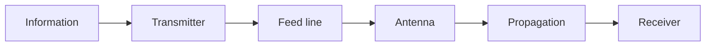

# 02 // Radio and Antenna Theory

## Signal chain

Study every block as energy, information, and a possible source of loss or distortion.

## Theory blocks

### Waves and information

- Frequency, period, wavelength, amplitude, phase, bandwidth, and `wavelength = wave speed ÷ frequency`
- Electromagnetic spectrum, Amateur Radio allocations, near field, and far field
- CW, AM, FM, single sideband, and common digital modes
- Noise floor, signal-to-noise ratio, filtering, sampling, aliasing, and SDR basics
- Harmonics, spurious emissions, overload, and intermodulation

### RF measurement

- dB, dBm, dBi, impedance, and the common 50-ohm radio system
- Forward/reflected power, return loss, SWR, feed-line attenuation, and connector loss
- Why low SWR does not automatically mean an effective antenna

### Propagation and antennas

- Line of sight, reflection, refraction, diffraction, absorption, and multipath
- Ground wave, tropospheric effects, and ionospheric propagation
- Frequency, terrain, height, weather, time, and solar effects
- Resonance, current distribution, dipoles, monopoles, loops, verticals, Yagis, and dishes
- Polarization, patterns, gain, beamwidth, front-to-back ratio, and nulls
- Balanced/unbalanced systems, baluns, common-mode current, chokes, matching, and tuning
- Installation effects from height, metal, walls, soil, and feed-line routing

## Antenna workflow

**PURPOSE → BAND → CONSTRAINTS → MODEL → BUILD → MEASURE → RECEIVE → ADJUST → DOCUMENT**

Preserve the intended band and receive/transmit status; assumptions; dimensions and materials; predicted pattern and resonance; analyzer calibration; as-built results; adjustment history; receive or licensed on-air results; and safety review.

## Receive-first progression

| Lab | Activity | Proof |
| --- | --- | --- |
| R1 | Create a local SDR spectrum map | Sanitized labeled observations |
| R2 | Compare two receive antennas | Controlled place, time, gain, and signals |
| R3 | Calculate wavelengths | Independent work with units |
| R4 | Build a receive-only dipole | Dimensions, continuity, observations |
| R5 | Identify local noise sources | Controlled comparisons and mitigation |
| R6 | Sweep a passive load or antenna | Calibration plane, plot, interpretation |
| R7 | Model/build a quarter-wave or directional antenna | Predicted versus measured behavior |
| R8 | Audit the receive station | Noise floor, overload, grounding, cable plan |

Do not decode, retain, publish, or act on private communications. Follow applicable law even when a signal is technically receivable.

## Transmit gate

- [ ] Hold the appropriate FCC Amateur Radio license.
- [ ] Verify current frequency, mode, bandwidth, power, and identification rules.
- [ ] Confirm equipment and antenna are suitable for the band.
- [ ] Inspect power, connectors, coax, strain relief, grounding, and exclusion distances.
- [ ] Complete an RF-exposure evaluation for the actual configuration.
- [ ] Start at the minimum practical power.
- [ ] Use a rated dummy load for tests that do not need radiation.
- [ ] Stop and diagnose interference instead of increasing power.

## ARRL study map

Use the current Technician manual first, then deepen the topic with the Handbook and Antenna Book.

| Topic | Target |
| --- | --- |
| Rules | Responsibility, privileges, identification, prohibited communications |
| Electricity | Components, symbols, Ohm's law, power, safety |
| Signals | Frequency, wavelength, modulation, bandwidth, harmonics |
| Propagation | VHF/UHF line of sight and HF ionospheric behavior |
| Antennas | Resonance, feed lines, SWR, gain, polarization, patterns |
| Station | Transmitters, receivers, grounding, interference, RF exposure |

A passing exam begins operating knowledge; it does not finish mastery.
