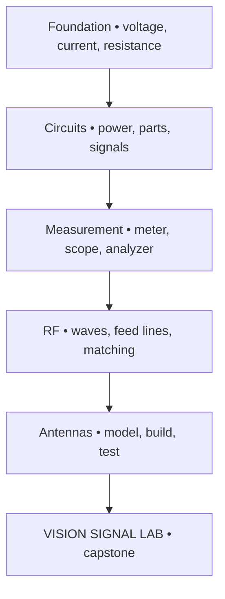

# VISION NODE // SIGNAL LAB

> Master electronics, circuit design, radio fundamentals, and antennas by building useful systems around the Vision Node.

## Mission

VISION SIGNAL LAB turns the Node into a low-voltage electronics bench, RF learning station, and documentation platform. Every lesson must help the operator **power, sense, protect, connect, measure, or explain** a real system.

Use the [AI-Assisted Mastery Loop](../ai-mastery-loop/README.md):

**READ → ASK AI → QUIZ → APPLY → REPEAT**

AI may explain, quiz, inspect a schematic, and challenge a design. It does not replace calculations, datasheets, measurements, licensing, safe construction, or the operator's first attempt.

## Learning architecture

## Mastery path

| Level | Focus | Build proof |
| --- | --- | --- |
| 1 — Power | DC safety, Ohm's law, power, series/parallel | Current-limited LED circuit |
| 2 — Parts | Resistors, capacitors, diodes, transistors, regulators | Protected 5 V load |
| 3 — Design | Schematics, tolerances, grounding, decoupling | Calculated, simulated, measured circuit |
| 4 — Signals | Frequency, amplitude, filters, sampling, noise | RC filter response |
| 5 — Radio | Spectrum, modulation, propagation, dB, wavelength | Receive-only SDR journal |
| 6 — Feed systems | Impedance, SWR, coax, loss, matching | Feed-line measurement report |
| 7 — Antennas | Patterns, polarization, gain, resonance | Modeled and measured receive antenna |
| 8 — Operation | Rules, station safety, interference | Technician readiness and station plan |
| 9 — Integration | Sensors, RF data, Linux, dashboards | VISION SIGNAL LAB capstone |

## Module sequence

1. [Study electronics and circuit design](01-electronics-and-circuits.md)
2. [Learn radio and antenna theory](02-radio-and-antennas.md)
3. [Build the Signal Lab projects](03-project-path.md)
4. [Complete Proof 004](04-proof-and-capstone.md)

## Primary study stack

| Purpose | Primary source |
| --- | --- |
| License foundation | [ARRL Ham Radio License Manual, 6th edition](https://www.arrl.org/ham-radio-license-manual/) — exams July 1, 2026–June 30, 2030 |
| Exam practice | [ARRL Exam Review](https://www.arrl.org/examreview) |
| Broad reference | *The ARRL Handbook for Radio Communications* |
| Antenna theory | [The ARRL Antenna Book, 25th edition](https://www.arrl.org/arrl-antenna-book-reference) |
| Rules | [FCC Part 97](https://www.ecfr.gov/current/title-47/chapter-I/subchapter-D/part-97) |
| RF safety | [ARRL RF Exposure](https://www.arrl.org/rf-exposure) and [calculator](https://www.arrl.org/rf-exposure-calculator) |
| Components | Manufacturer datasheets and application notes |

ARRL material is the curriculum spine, not content to copy. Keep original notes, diagrams, calculations, measurements, and short source references. Do not upload copyrighted books or answer keys.

## Entry gate

- [ ] The AI study method is understood.
- [ ] The first bench uses current-limited, extra-low-voltage DC only.
- [ ] A digital multimeter and eye protection are available.
- [ ] Power is disconnected before wiring changes.
- [ ] Expected voltage, current, and polarity are written before power-on.
- [ ] Receive-only RF work is the default until licensing and safety gates are complete.

## Non-negotiable boundaries

- Do not build or modify mains-voltage circuits in this module.
- Do not transmit on Amateur Radio frequencies without the required license and privileges.
- Stay within authorized frequencies, modes, bandwidths, and power limits.
- Do not defeat certification or limits on unlicensed devices.
- Never connect a transmitter directly to SDR or test-equipment inputs.
- Use a rated dummy load for appropriate bench tests.
- Complete an RF-exposure evaluation before an antenna transmits.
- Keep antennas and supports away from power lines and unsafe weather.
- Use qualified help for outdoor grounding and lightning protection.
- Stop for heat, smoke, odor, swelling cells, unexpected current, or damaged insulation.

## Completion standard

The operator can calculate, design, simulate, build, measure, troubleshoot, and explain a low-voltage circuit; describe RF, propagation, feed lines, and antennas; find the controlling radio rule; complete a station-safety review; integrate one signal source with Linux; recover from a controlled fault; and teach the system plainly.

## Brand principle

**MAKE THE SIGNAL VISIBLE. MEASURE BEFORE YOU ASSUME. DOCUMENT WHAT YOU LEARN.**
