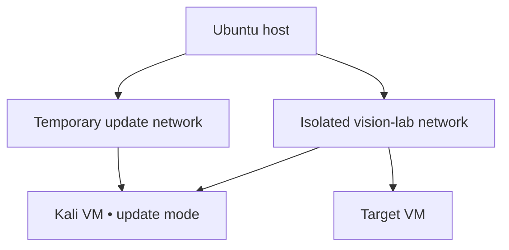

# VISION NODE // Isolated Cyber Lab

> A legal, contained environment for learning how attacks work so systems can be designed and defended better.

## Scope

This module supports training against intentionally vulnerable local machines, your own disposable applications, CTF challenges, and systems for which you have explicit written authorization. It does not authorize testing third-party systems.

## Architecture

**Critical rule:** Kali uses either update mode or lab mode—not both simultaneously. The target uses lab mode only.

## Resource budget

| System | vCPU | RAM | Disk | Network |
| --- | ---: | ---: | ---: | --- |
| Ubuntu host reserve | — | 6–8 GB | Host-managed | Physical LAN |
| Kali workstation | 2 | 4 GB | 60 GB | Update or isolated lab |
| Vulnerable target | 1–2 | 2 GB | 20–40 GB | Isolated lab only |

## Module sequence

1. [Charter and safety gate](00-charter.md)
2. [Install KVM/libvirt](01-kvm-foundation.md)
3. [Create the isolated network](02-isolated-network.md)
4. [Create the Kali workstation](03-kali-workstation.md)
5. [Add targets and train](04-targets-and-learning-path.md)

## Phase gate

Do not begin until Ubuntu passes validation, SSH and firewall work, an independent backup exists, virtualization is enabled, at least 150 GB is free, and local-console recovery is available.
