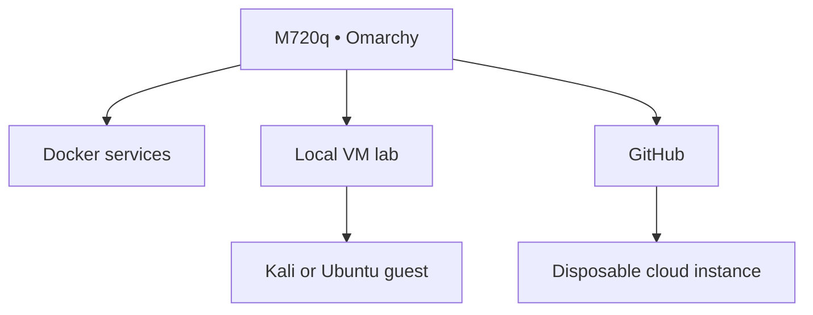

# VISION NODE // Omarchy Operator Edition

> A visual, keyboard-first Linux workstation that also serves as a local container, VM, security, and cloud-engineering lab.

## Best fit

Choose this edition when the main goal is to sit at Vision Node and actively build:

- Linux and terminal mastery
- AI-assisted development
- Git/GitHub workflows
- Docker applications
- Local virtual machines
- Ethical security exercises
- Cloud engineering from a dedicated command station

Choose the [ZimaOS edition](../../../README.md) when the main goal is a simpler, mostly unattended personal server and NAS.

## Hardware fit

| Component | Assessment |
| --- | --- |
| Intel i5-8400T | Good for Omarchy, containers, and one VM |
| Intel UHD 630 | Appropriate for a lightweight Hyprland desktop; verify display behavior |
| 16 GB RAM | Usable; one substantial VM at a time |
| 500 GB NVMe | Enough for OS, tools, and limited VM images |
| Internal 5 GHz Wi-Fi | Supported if the exact adapter works in Arch Linux |
| Rack display | Required for the intended operator-console experience |
| Keychron Q6 Max | Use wired mode during installation and encrypted boot |

## Architecture

## Resource budget

| Layer | CPU | RAM | Storage |
| --- | ---: | ---: | ---: |
| Omarchy host + desktop | Host-managed | Reserve 6–8 GB | 80–120 GB |
| Containers | Shared | 1–3 GB total initially | 40–80 GB |
| One local VM | 2 vCPU | 4 GB | 50–60 GB |
| Free reserve | — | — | At least 150 GB |

## Build order

1. [Preflight and installation](01-install.md)
2. [Wi-Fi-only operation](02-wifi.md)
3. [Containers and local VMs](03-containers-vms.md)
4. [Cloud-instance workflow](04-cloud-workflow.md)
5. Reuse the repository's backup, GitHub, and cyber-lab safety policies.

## Important difference

Omarchy is a desktop distribution based on Arch Linux and Hyprland. It is not primarily a NAS operating system or a headless server dashboard. Rolling updates require more active ownership than an appliance-style system.

This edition turns Vision Node into a **lab console that can serve**, rather than a **server that happens to have a screen**.
